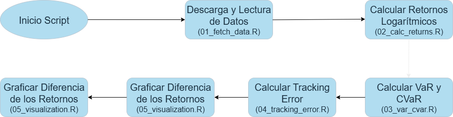

```{r setup, include=FALSE}
# Bloque de configuración de R. Hacemos que el código se ejecute pero no se 
# muestre en el md.
knitr::opts_chunk$set(
  echo = FALSE,      # No mostrar el código R en el reporte
  warning = FALSE,   # No mostrar advertencias
  message = FALSE    # No mostrar mensajes
)
```

# Documentación del Proyecto

A continuación, se presenta la documentación del proyecto, incluyendo una ficha de modelo y un diagrama de flujo del proceso, según los requerimientos de la entrega.

## Ficha de Modelo

Esta ficha resume las características clave de la solución desarrollada.

* **Información del Modelo**
    * **Nombre:** Herramienta de Benchmarking de Riesgo para Fondos.
    * **Versión:** 0.0.1a
    * **Propietario:** Rodrigo García Hoffmann.
    * **Fecha:** 27 de julio de 2025.

* **Propósito y Usuarios**
    * **Propósito:** Automatizar el cálculo y la comparación de métricas de riesgo de mercado (*VaR, CVaR, Tracking Error*) para fondos mutuos o de inversión frente a su benchmark.
    * **Usuarios Principales:** Portfolio Managers, Gerencia de Riesgo de Mercado.

* **Datos Utilizados**
    * **Datos de Entrada:** Valores cuota diarios del fondo (archivo `fm_acciones_usa.xlsx` en el MVP, sacados de la CMF) y precios de cierre del S&P 500 (archivo `snp.xlsx` en el MVP, generado desde Yahoo Finance a través de la librería `yahoofinancer`).
    * **Periodo de Datos:** 02 de enero de 2022 a 31 de diciembre de 2024.

* **Proceso de Limpieza y Transformación de Datos**
    1.  **Lectura:** Se leen los datos inicialmente desde archivos `.xlsx` y de Yahoo Finance, para posteriomente avanzar a fuentes de datos internas (valores cuota calculados por la misma administradora e índices desde terminal Bloomberg, por ejemplo).
    2.  **Selección y Renombrado:** Se estandarizan los nombres y se seleccionan las columnas de fecha y precio.
    3.  **Unión (Join):** Se realiza un `inner_join` usando la fecha como llave, para así garantizar que no se generen problemas inhábiles tanto locales como internacionales.
    4.  **Cálculo de Retornos:** Se calculan los retornos logarítmicos diarios.
    5.  **Manejo de Nulos:** Se elimina la primera fila de retornos (`NA`).

* **Limitaciones y Consideraciones**
    * El **Tracking Error** está afectado por el tipo de cambio (CLP/USD), por lo que no refleja únicamente el riesgo de la gestión activa.
    * El **VaR paramétrico** asume que los retornos siguen una distribución normal, lo cual es una simplificación de la realidad de los mercados financieros.
    * La estimación del Tracking Error a períodos más largos (en este caso un año) puede no ser tan precisa en la práctica.

## Diagrama de Flujo del Proceso

El siguiente diagrama ilustra el flujo de trabajo orquestado por el script `main.R`.

```{r diagrama, fig.cap="Diagrama de flujo del proceso automatizado.", out.width='100%'}

```

\newpage

# Estrategia de Despliegue

El objetivo es automatizar la ejecución del script `main.R` para generar un reporte de riesgo actualizado de forma periódica. Se propone un despliegue en dos fases:

* **Fase 1: Automatización del Proceso en un Entorno Controlado**

    El primer paso para llevar este proyecto a la práctica es asegurar que el análisis se ejecute de forma automática y regular. Para esto, se propone lo siguiente:

    1.  **Preparación del Entorno:** Se habilitaría un espacio de trabajo en un servidor de la compañía. En este lugar se instalaría R y se replicaría el entorno del proyecto para garantizar que el código funcione siempre de la misma manera.

    2.  **Programación de la Tarea:** Se programaría la ejecución automática del script `main.R` para que se active al comienzo de cada semana a primera hora de la mañana. Esto asegura que los Portfolio Managers dispongan de la información actualizada al comenzar su semana.

    3.  **Distribución de Resultados:** El script se ajustaría para que, en vez de solo mostrar los resultados en una pantalla, genere un reporte sencillo (por ejemplo, un dashboard o un correo con los datos clave) y lo distribuya automáticamente a los involucrados.


* **Fase 2: Contenerización con Docker (Enfoque avanzado y portable)**
    * Para asegurar una portabilidad y reproducibilidad perfectas, el siguiente paso sería "contenerizar" la aplicación usando **Docker**. Se crearía un `Dockerfile` que empaquete el sistema operativo base, R, las dependencias del sistema y el código del proyecto en una imagen. Esta imagen podría ejecutarse en cualquier entorno que soporte Docker (local, on-premise, nube), garantizando que siempre funcione de la misma manera.

# Estrategia de Monitoreo

Una vez desplegado, el sistema debe ser monitoreado para asegurar su correcto funcionamiento y la validez de sus resultados.

* **Monitoreo Operacional (¿Está funcionando?)**
    1.  **Logs de Ejecución:** El script `main.R` registrará en un archivo de texto cada ejecución, indicando hora de inicio, fin y si hubo errores. Ejemplo: `2025-07-28 08:00:15 - INFO - Inicio del script.` — `2025-07-28 08:00:45 - ERROR - Falla al descargar datos.`.
    2.  **Alertas de Falla:** Se implementará un bloque `tryCatch` en `main.R`. Si el script falla por cualquier motivo, el bloque `catch` enviará un correo electrónico de alerta al área responsable con el mensaje de error.

* **Monitoreo de Métricas y Datos (¿Es coherente?)**
    1.  **Validación de Datos de Entrada:** Antes de correr los cálculos, el script verificará que los datos descargados son válidos (ej., que no vengan vacíos o con formatos extraños).
    2.  **Seguimiento de Métricas Clave:** Se guardaría un historial de las métricas calculadas. Cambios bruscos o inesperados (ej., un VaR que se dispara sin motivo aparente) generarían una alerta para revisión manual.
    3.  **Establecimiento de Límites y Alertas:** Se definirán distintas categorías de riesgo para los fondos administrados. Estas categorías de riesgo tendrán niveles de alerta y límite. En caso de superar estos niveles, las áreas de riesgo tendrán que exigir a los Portfolio Managers que se definan acciones correctivas en caso de que los límites sean superados por gestión activa de parte de las áreas tomadoras de riesgo.